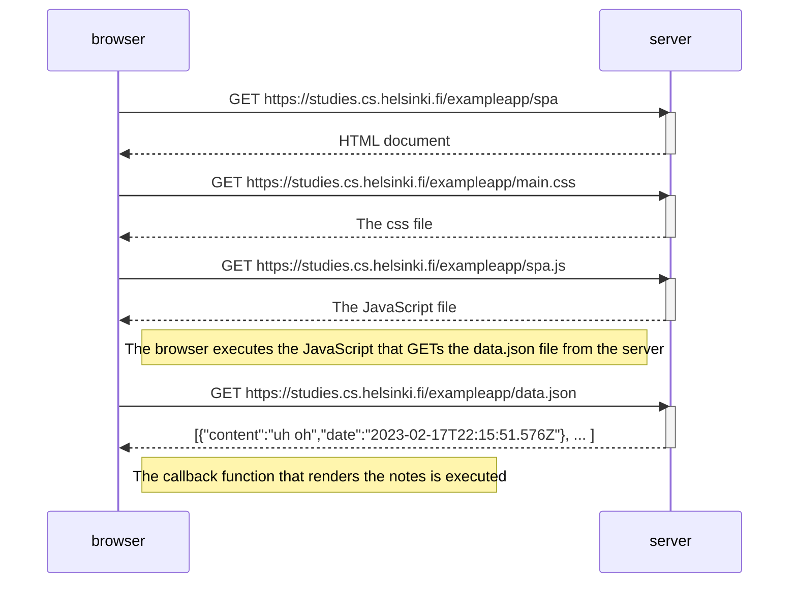

```mermaid
sequenceDiagram
participant browser
participant server

browser->>server: GET https://studies.cs.helsinki.fi/exampleapp/spa
activate server
server-->>browser: HTML document
deactivate server

browser->>server: GET https://studies.cs.helsinki.fi/exampleapp/main.css
activate server
server-->>browser: The css file
deactivate server

browser->>server: GET https://studies.cs.helsinki.fi/exampleapp/spa.js
activate server
server-->>browser: The JavaScript file
deactivate server

Note right of browser: The browser executes the JavaScript that GETs the data.json file from the server

browser->>server: GET https://studies.cs.helsinki.fi/exampleapp/data.json
activate server
server-->>browser: [{"content":"uh oh","date":"2023-02-17T22:15:51.576Z"}, ... ]
deactivate server    

Note right of browser: The callback function that renders the notes is executed
```