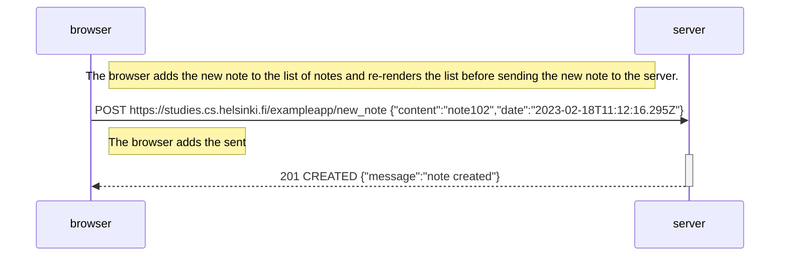

```mermaid
sequenceDiagram
participant browser
participant server

Note right of browser: The browser adds the new note to the list of notes and re-renders the list before sending the new note to the server.
browser->>server: POST https://studies.cs.helsinki.fi/exampleapp/new_note {"content":"note102","date":"2023-02-18T11:12:16.295Z"}
Note right of browser: The browser adds the sent
activate server
server-->>browser: 201 CREATED {"message":"note created"}
deactivate server
```